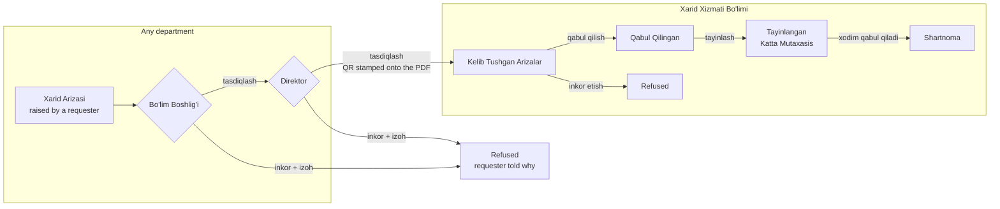
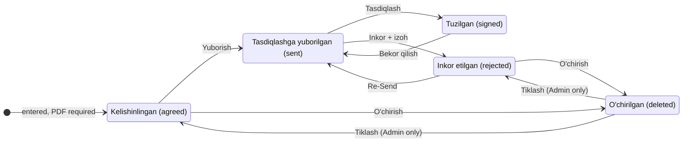
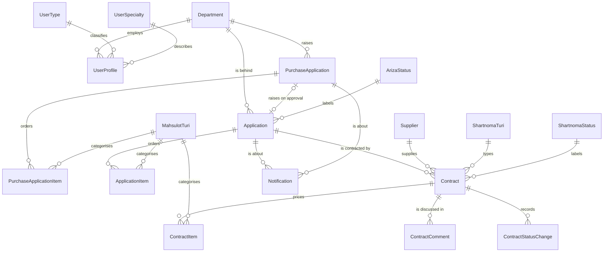

<div align="center">

# Uz-Koram · Xarid Xizmati Bo'limi

**Department automation for the purchasing service of "Uz-Karam Co MCHJ QK"**

[](https://www.python.org/)
[](https://www.djangoproject.com/)
[](https://jinja.palletsprojects.com/)
[](https://www.sqlite.org/)
[](#quality-gates)
[](https://docs.astral.sh/ruff/)
[](#languages)

</div>

Built from the technical assignment *"Xarid Xizmati Bo'limi — Automatlashtirish
uchun Texnik vazifa"*. One Django project (`config`) and one Django application
(`xarid`, Uzbek for *purchase*), rendered server-side through Jinja2 over the
Bootstrap front end supplied with the assignment, on SQLite, behind Django's own
authentication.

Every requirement the assignment states is quoted as a `REQ-…` and every
question it left open is answered by a recorded `DEC-0xx`. Both are named
throughout this file and in the source, so a rule on a page can be traced back
to the sentence that asked for it.

---

## Contents

| | | |
| --- | --- | --- |
| [Quick start](#quick-start) | [What it does](#what-it-does) | [How work flows](#how-work-flows) |
| [The domain model](#the-domain-model) | [Who can open what](#who-can-open-what) | [Filters, paging, exports](#tables-everywhere-filters-paging-exports) |
| [Reports](#reports) | [Languages](#languages) | [Attachments and documents](#attachments-and-generated-documents) |
| [Project layout](#project-layout) | [Configuration](#configuration) | [Command reference](#command-reference) |
| [Quality gates](#quality-gates) | [Technical documents](#technical-documents) | |

---

## Quick start

Python **3.12** and the packages in `requirements.txt` — Django 5.1, Jinja2,
python-dotenv, qrcode, Pillow, pypdf, openpyxl and reportlab.

> [!TIP]
> Seven commands and you are signed in. `DJANGO_DEBUG=1` is the one that matters
> locally — without it the development server serves no static files and every
> page arrives unstyled.

```bash
python -m venv venv
source venv/bin/activate          # Windows: venv\Scripts\activate
pip install -r requirements.txt
cp .env.example .env              # then set DJANGO_DEBUG=1 inside it
python manage.py migrate          # also seeds the master data (see below)
python manage.py createsuperuser
python manage.py runserver
```

<details>
<summary><b>Windows PowerShell — the same thing</b></summary>

```powershell
python -m venv venv
venv\Scripts\Activate.ps1
pip install -r requirements.txt
Copy-Item .env.example .env       # then set DJANGO_DEBUG=1 inside it
python manage.py migrate
python manage.py createsuperuser
python manage.py runserver
```

</details>

The application answers at **<http://127.0.0.1:8000/>**. Settings are read from
the environment and `config/settings.py` loads `.env` into it at startup, so
filling in the copied file is all the configuration a development machine needs;
a variable exported in the shell still wins over the file.

`migrate` seeds the master data the application cannot start without: the six
User Types, the four application statuses, the five contract statuses and the
two contract types. The superuser may open every page and the Django admin.

<details>
<summary><b>First five minutes — a walk through the whole flow</b></summary>

Sign in as the superuser, then:

- [ ] **Ma'lumotlar → Bo'limlar** — add two departments, and tick
      *Xarid bo'limi* on the one that is the purchasing department.
- [ ] **Ma'lumotlar → Foydalanuvchilar** — create a `Katta Mutaxasis` in the
      purchasing department and a `Users` account in the other one.
- [ ] **Ma'lumotlar → Firmalar** — add a firm to buy from.
- [ ] Sign in as the requester → **Hisobotlar → Xarid Arizasi** → raise a
      request with a product line.
- [ ] Sign in as that department's head → approve it; then as the Direktor →
      approve it again. The PDF is stamped with a QR code and an application
      appears in the purchasing department.
- [ ] Back as an administrator → **Arizalar → Kelib Tushgan** → accept it, then
      **Qabul Qilingan** → assign it to the specialist.
- [ ] As the specialist → **Arizalar → Tayinlangan** → take the work up, then
      **Shartnomalar → Kelishinlingan** → enter a contract (a PDF is required)
      and press **Yuborish**.
- [ ] As an administrator → **Shartnomalar → Tuzilgan** → approve it, or reject
      it with a comment and watch it come back for a **Re-Send**.
- [ ] Watch the bell in the header the whole way: every one of those steps tells
      somebody.

</details>

---

## What it does

| Area | Pages | In one line |
| --- | --- | --- |
| **Master data** | `Ma'lumotlar` (8 pages) | A table beside a form; deleting deactivates, so records that already refer to it still resolve. |
| **Users** | `Foydalanuvchilar` | Accounts, their User Type and department, and the exclusive contract-editing grant. |
| **Applications** | `Kelib Tushgan` · `Qabul Qilingan` · `Tayinlangan` | Accepted or refused with a reason, then handed to a senior specialist who takes it up and reports on it. |
| **Contracts** | `Kelishinlingan` · `Tuzilgan` · `O'chirilgan` | Entered with priced rows and a PDF, sent for approval, decided, commented on, and reversibly deleted. |
| **Purchase requests** | `Xarid Arizasi` | A requester asks; their head approves, then the Direktor — which stamps a QR code onto the PDF and raises the department's own application. |
| **Dashboard** | `Asosiy panel` | Supplier count, signed and completed percentages, spendings for a chosen period, processing times, top suppliers, supplier categories. |
| **Reports** | `Hisobotlar` (5 pages) | Workload per specialist, purchasing per department and per product type, every ordered line, and the supplier ranking. |
| **The log** | `Tizim → Loglar` | Every create, edit, delete and approval the application made, with who did it and when. |
| **Notifications** | the bell, `Bildirishnomalar` | In-app only (DEC-012): fourteen kinds, from "your request was refused" to "a contract now waits for your decision". |

<details>
<summary><b>Master data</b> — eight pages, six of them Admin-only</summary>

User Specialty, User Types, Ariza Status, Shartnoma Status, Mahsulot Turlari,
Shartnoma Turi, Bo'limlar and Firmalar, each a table beside a form. **Deleting
deactivates**: the record leaves the lists while anything that already refers to
it still resolves (DEC-009).

Two of the eight are not Admin-only, because they are the purchasing
department's own vocabulary and waiting on an administrator to extend it blocks
the work that needed it:

- **Mahsulot Turlari** — the categories every application and every report is
  written in terms of. Xarid Bo'limi's own Bo'lim Boshlig'i maintains them; a
  category added without a Category Raqami is given the next free six-digit
  number.
- **Firmalar** — the list of firms the company buys from, kept by that
  department's Bo'lim Boshlig'i, Menejer and Katta Mutaxasis.

Both are questions about the *department* rather than about the *type*, so the
same type in another department is refused — `_PURCHASING_DEPARTMENT_PAGES` in
`xarid/permissions.py` asks the second question after the matrix has answered
the first.

</details>

<details>
<summary><b>Applications</b> — accepted, assigned, taken up</summary>

Incoming applications are accepted or rejected with a reason; accepted ones are
created, listed and assigned to a senior specialist, who takes the work and
reports its status.

The specialists on offer are **Xarid Bo'limi's own Katta Mutaxasis accounts and
nobody else's** — handing the work out is the purchasing department's, so it
hands it to its own people — and the assignment route checks the same rule the
drop-down shows. While no department is marked as the purchasing one, every
active Katta Mutaxasis is offered.

An application carries two PDFs: the **Ilova PDF**, the attachment exactly as it
arrived (DEC-019), and the **Ariza PDF**, drawn from the record on every request
so it cannot fall out of step with the row the table shows.

</details>

<details>
<summary><b>Contracts</b> — entered, sent, decided, commented, deleted, restored</summary>

A contract with priced goods rows is entered against an assigned application;
its value is the total of the rows (REQ-SHARTNOMA-006), and the form will not
save without a PDF — a contract is a document before it is a row, and a row
without the document it records is a claim nobody can check.

- **Ko'rish** opens a details dialog fetched as a fragment, so each page carries
  one dialog rather than one per row.
- **Tahrirlash** reopens the same entry dialog, filled in, pointed at the edit
  action — one way of filling a contract in rather than two.
- **Izoh** is a thread. Comments are kept for the life of the contract and never
  edited, because a record somebody can go back and change is not one. Anybody
  who may open the page may write in any thread it shows: acting on a contract
  still asks whose it is, but a thread only its holder may write to is a thread
  a head cannot ask a question in.
- **O'chirish** is reversible (TASK-UZK-064). The row stays and is marked;
  `Contract.objects` stops seeing it everywhere at once and
  `Contract.all_objects` is the deliberate way back. Admin alone opens
  **O'chirilgan Shartnomalar**, where **Tiklash** returns the contract to the
  stage it was deleted at.
- **Shartnoma PDF** is drawn from the record — but only once the contract is
  settled. A sheet that looked like a contract while nobody had agreed to it is
  the one document this must never hand over, so the control is drawn muted and
  the URL answers the same thing to anybody who asks for it anyway.

</details>

<details>
<summary><b>Dashboard</b> — what is counted, and what is still the prototype</summary>

Counted from the database: the supplier count, and the signed and completed
contract percentages measured against it. Which contract status means *signed*
and which means *completed* are both marked on the **Shartnoma Status** page,
because the statuses are editable master data.

`Tuzilgan Shartnomalar %` counts the contracts that reached the signed status,
not every contract raised (DEC-039): the indicator shares its name with that
status, and a contract raised and later refused is not one the department
signed.

The **spendings** card adds up contract values — the total inside the period
chosen in the bar, with the calendar year's agreed total under it, both in UZS.
The period narrows that card alone; the other three report where the department
stands now. A contract is accounted under its own contract date, or the day it
was raised when it has none. **Savings has no formula yet (DEC-025) and says
so.**

A panel gives the **average processing time** of the four stages the assignment
names, in days (see the table below). The **Top suppliers** panel shows the
first five of the Top suppliers page and links to it. The **supplier category**
block counts how many distinct firms supply each product type — a type nobody
supplies is listed with zero — beside the number of types actually *delivered*,
meaning those that reached the status marked completed rather than those
somebody merely has a contract for. Its bar chart draws the same rows as its
table. A firm is credited with every type its application ordered, because a
contract is against an application and not against one of its lines. A share is
that type's count as a percentage of the table, so the column adds to a hundred;
a firm supplying two types is counted under both, which the block says under it.
REQ-DASH-009 words the share as a percentage of total firms instead, which is
the same number only while no firm supplies more than one type.

> [!NOTE]
> **Still the supplied prototype's sample data:** the 12-month spendings chart
> and the activity list. Everything else on the page is counted.

#### What the processing-time stages are measured between

The assignment names four stages and no events, and DEC-025 decides only where
Invoice comes from. These definitions are this application's own; the panel
prints each one beside its figure so it can be argued with.

| Stage | From | To |
| --- | --- | --- |
| Buyurtma kiritish | the application arriving | the contract raised against it |
| Tasdiqlash | the contract being raised | it being approved |
| Yetkazib berish | approval | the first move into the status marked completed |
| Invoice | that same move | the invoice date on the contract |

Approval is measured from the raising rather than from `yuborilgan_sana`,
because a resend overwrites that column (DEC-024) and a contract sent twice
would report only the time since its last send. An average covers only the
contracts that recorded both of its ends: a stage nothing has completed prints a
dash, not nought days.

</details>

<details>
<summary><b>Notifications</b> — fourteen kinds, in-app and nothing else</summary>

Delivery is in-app only — an entry on the Bildirishnomalar page and a number on
the bell in the header — with no email and no SMS (DEC-012). Opening the page
marks what it showed as read. The page is closed by `login_required` alone: it
is not a page a user type may open, it is everybody's own.

| What happened | Who hears about it |
| --- | --- |
| An application is accepted, or refused | its sender, with the reason |
| A specialist takes up assigned work | every Admin, and Xarid Bo'limi's own Bo'lim Boshlig'i and Menejer |
| A purchase request moves a step along DEC-016's chain | the people it now waits for, **and** the requester watching it move |
| An approved request arrives | the purchasing department |
| A contract is sent for approval | Xarid Bo'limi, told a decision now waits |
| A contract's status moves | that department's head |
| Somebody writes in a contract's thread | everybody else already in that conversation |
| A contract is approved, returned, or its approval undone | whoever the contract belongs to |

A notification is about exactly one record — an application or a purchase
application — enforced by a check constraint; a contract's number and firma
travel in the `izoh` line. An application entered on the Qabul qilingan page has
no sender behind it (DEC-031), so it tells nobody.

`python manage.py notify_waiting_requests` delivers the notification the current
step *would* have produced, for requests that were already in flight when
notifications were added: nothing replays a transition that has already
happened. It is safe to run twice — a step already told is skipped — and
`--check` says what it would do without writing.

</details>

<details>
<summary><b>The log</b> — section 10, nine columns, one row per record</summary>

Every create, edit and delete the application makes **through its own pages**
writes one entry naming the acting user, their department at the time, the
record, and when. An approval does not add a row — it completes the one the
creation left, with the approver, their department, the comment and the time,
which is the row section 10's columns describe.

Entries are kept indefinitely and the application builds no way to edit or
delete one (DEC-029); the Django admin registers the table for reading only, and
deleting a user there is refused while they hold entries. A record approved
twice — a purchase request goes to the department head and then to the director
(DEC-016) — gets a second entry rather than having the first approver
overwritten, because the columns hold one approver. **Writes made through the
admin, a shell or a migration are not logged.**

`Tizim → Loglar` lists those entries newest first with the nine columns section
10 names and a drop-down per column — user, department, form, action — beside
the period. An entry nobody has decided leaves its four approval cells empty
rather than labelling them. There is no export: section 10 is the one page that
does not ask for one (DEC-029).

</details>

> [!NOTE]
> **The 1C integration screen** (`Tizim → 1C Integratsiya`) is still the
> supplied prototype page with sample data.

---

## How work flows

### The two ways work arrives



Two records, deliberately: a **`PurchaseApplication`** is what a requester asked
for, and the **`Application`** it raises on approval is what the purchasing
department works on. An application may also be keyed straight in on the Qabul
qilingan page, in which case it has no sender behind it (DEC-031).

### A contract's life



The **stage** above is not the **status**. The stage is where a contract has got
to in the approval flow and the code may rely on it; the status
(`Shartnoma Status`) is editable master data an administrator invents and
extends, and nothing in the code may name a particular one. The two pages a
contract can be on follow from its stage: `agreed` and `rejected` are on
**Kelishinlingan**, `sent` and `signed` are on **Tuzilgan**.

<details>
<summary><b>Contract statuses</b> — why almost nothing is enforced</summary>

A contract's status is moved from the `Kelishinlingan` page, by the specialist
whose application it was raised against. What is enforced is narrower than
"permitted transitions" sounds, and the narrowness is deliberate: DEC-010 makes
the statuses rows an administrator invents and extends, and `ShartnomaStatus`
carries no code column, so nothing in the code may name a particular status or
draw a graph between two of them. A transition table over names would be a table
the `Shartnoma Status` page could invalidate.

So what `Contract.set_status()` enforces is what the data can say:

- the status must be one that is in use;
- the contract must still be in `Contract.MOVABLE_STAGES` — agreed, rejected or
  signed — so one awaiting approval is not moved underneath whoever is approving
  it;
- moving to the status it already has is not a move, and writes nothing.

**No order between two statuses in use is enforced.** The order the department
works to is not in the specification, and inventing one here would make an open
question look answered.

Every move writes a `ContractStatusChange` in the same transaction: the previous
status, the new one, who moved it and when. It is the first history table in the
application — everything else keeps current state only, because DEC-024 puts
history in the section 10 log — and it exists because "keeps changing" is a
sequence: a contract at `Yetkazib berilgan` with no record of when it passed
`Shartnoma tuzilgan` cannot answer what the department asks. The update is
conditional on the status being moved from, so two clicks arriving together
produce one move and one history row.

A specialist may move only a contract whose application is assigned to them,
asked through the assignment rather than through who created the contract:
DEC-024 lets an Admin re-assign at any time, and the contract goes with the
work. Everybody else the matrix lets onto the page may move any of them.

#### Two questions that look like one

`EDITABLE_STAGES` says whether a contract's **terms** may change.
`MOVABLE_STAGES` says whether its **progress** may be reported. They were one
constant until the status chain had to continue past approval, and sharing them
would have frozen an approved contract's status forever — so DEC-010's seeded *Yetkazib berilgan*, which
happens after a contract is signed, could never be reached, and DEC-028's
"continues through its status chain" would have been impossible.

`SENT` is the stage that refuses a status move: a contract awaiting a decision
must not change underneath the person making it. Which is why the status control
lives on both pages, and why the status route returns to whichever one it was
used from.

</details>

<details>
<summary><b>Sending a contract for approval</b> — and what a second send answers</summary>

`Yuborish` on the `Kelishinlingan` page sends a contract to the department head.
Sending takes it out of the specialist's hands, which takes it off that page —
the page is the contracts still theirs to work on — so the message names where
the contract went rather than only that it went: a row disappearing with no
explanation is how somebody concludes they deleted something.

A second send is refused, and the refusal says **which** refusal it is. A
contract awaiting approval and one already approved are different answers, and
being told the wrong one sends whoever reads it looking for a queue the contract
left days ago.

After a rejection the control reads **Re-Send** (DEC-024), and the contract may
be corrected before it is resent. It is the same route: a resend is the same act
again. The rejection comment is **not** cleared by a resend — the approver about
to look at the contract again is the person most helped by seeing why it came
back, and the stage is what says it has moved on.

`yuborilgan_sana` and `yuborgan` hold the **last** send and are overwritten by a
resend; `yuborishlar_soni` counts them, because how many times a contract came
back is the question the department will actually ask.

</details>

<details>
<summary><b>The department head's decision</b> — five types may read it, three may decide</summary>

`Tuzilgan Shartnomalar` is where the contracts sent for approval arrive. Five
user types may open it and **three of them decide**. REQ-SHARTNOMA-002 gives the
decision to the department head; DEC-013 read that as Admin, because "Admin is
the Xarid bo'lim boshlig'i", and where the department is actually staffed the
head and the manager hold accounts of their own two types, and the decision is
theirs (TASK-UZK-067). Admin keeps it as well — a contract nobody left in the
office can decide is a contract that stops.

**Its own, not any**: a Bo'lim Boshlig'i of another department cannot open the
page at all, and a Menejer elsewhere has no business approving what this
department has committed to. The controls render for the three and **the route
asks again**, because a page-level permission on its own would let the other two
types approve a contract that binds the company.

**Accepting** marks the contract approved and records who and when.
REQ-SHARTNOMA-002 says an accepted contract goes to the next department and
DEC-028 says there is no such department, so nothing is built for it: the
contract continues through its status chain here, and the gap stays visible
rather than being filled with an invented integration. Accepting does not move
the status either — that chain is something a person chooses. **Bekor qilish**
undoes the approval and puts the contract back in front of the decision.

**Rejecting** demands a comment, refused in the model and not only on the page,
because a page is one way in. Where a rejection lands is the half worth stating:
*returned back* is not a stage of its own. It is the contract on the
`Kelishinlingan` page again, with its comment in the column REQ-SHARTNOMA-004
gives it and the `Re-Send` control DEC-024 names.

</details>

<details>
<summary><b>A purchase request and its contract</b> — why nothing is copied</summary>

The `Xarid Arizasi` list shows a request the state of the contract formed from
it. The chain is three hops — request, the department application it raised on
approval, the newest contract against that — and **any hop may be missing**: a
request that has not been approved raised no application, and one that has may
have no contract yet. Each missing hop is an ordinary state, and the request
then shows what it always showed.

**There is no mapping, and that is the mapping.** DEC-010 makes `Ariza Status`
and `Shartnoma Status` independent tables an administrator extends separately,
and defines no correspondence between them. A translation table written here
would be invented in the code and invalidated by the next row somebody adds on
either page. So the contract's status is shown **as it is** — and because the
two tables need not even look related, the row says the state came from the
contract, or a requester would have no way to tell why the word changed.

**Derived, never copied.** A column kept in step by a hook is out of step the
first time something writes around the hook, and this record needs no column:
the contract knows its status and the request knows its contract. The request's
own `status` is left exactly as it was, so the record still knows what it was
raised as.

The contract's **number** appears in that explanation only for somebody who may
open the page the contract is currently on — `Contract.page_showing` answers
where that is. DEC-015 gives Users this page and no contract page at all, so
naming the contract to them would hand over a fact from a page they cannot open,
and the list is deliberately not filtered by requester. It is the rule the
attachment download already follows.

</details>

---

## The domain model



Master data (`UserType`, `UserSpecialty`, `Department`, `ArizaStatus`,
`ShartnomaStatus`, `MahsulotTuri`, `ShartnomaTuri`, `Supplier`) all descend from
`MasterDataRecord`, which is what makes *deleting* mean *deactivating*.
`AuditEntry` is deliberately outside this diagram: it holds its record as a
name, a label and a plain integer rather than by foreign key, because an entry
about a deletion has to outlive the record it describes.

Every table and column, generated from the models, is in
[`docs/database-schema.md`](docs/database-schema.md); the class diagram is in
[`docs/uml/domain-model.puml`](docs/uml/domain-model.puml).

---

## Who can open what

Signing in lands on the **first page the account may open**, in the sidebar's
own order (`xarid:landing`). A user's role is their **User Type**, a master data
row held on `xarid.UserProfile`. Six are seeded and marked as system roles:
Admin, Bo'lim Boshlig'i, Menejer, Katta Mutaxasis, Direktor and Users.
`xarid/permissions.py` holds the matrix; a signed-in visitor of the wrong type
gets **403**, and the sidebar shows only what the current user may open.

<!-- Generated from xarid/navigation.py and xarid/permissions.py. -->

| Group | Page | Admin | Bo'lim Boshlig'i \* | Menejer | Katta Mutaxasis | Direktor | Users |
| --- | --- | :-: | :-: | :-: | :-: | :-: | :-: |
| Umumiy | Asosiy panel | ✅ | ✅ | ✅ | — | ✅ | — |
| Ma'lumotlar | Mutaxassislik | ✅ | — | — | — | — | — |
| Ma'lumotlar | Foydalanuvchi turlari | ✅ | — | — | — | — | — |
| Ma'lumotlar | Foydalanuvchilar | ✅ | — | — | — | — | — |
| Ma'lumotlar | Ariza Status | ✅ | — | — | — | — | — |
| Ma'lumotlar | Shartnoma Status | ✅ | — | — | — | — | — |
| Ma'lumotlar | Mahsulot Turlari | ✅ | ✅ | — | — | — | — |
| Ma'lumotlar | Shartnoma Turi | ✅ | — | — | — | — | — |
| Ma'lumotlar | Bo'limlar | ✅ | — | — | — | — | — |
| Ma'lumotlar | Firmalar † | ✅ | ✅ | ✅ | ✅ | — | — |
| Arizalar | Kelib Tushgan | ✅ | ✅ | ✅ | — | ✅ | — |
| Arizalar | Qabul Qilingan ‡ | ✅ | ✅ | ✅ | — | ✅ | — |
| Arizalar | Tayinlangan | ✅ | ✅ | ✅ | ✅ | — | — |
| Shartnomalar | Kelishinlingan | ✅ | ✅ | ✅ | ✅ | — | — |
| Shartnomalar | Tuzilgan | ✅ | ✅ | ✅ | ✅ | ✅ | — |
| Shartnomalar | O'chirilgan | ✅ | — | — | — | — | — |
| Hisobotlar | Xodimlar Yuklamasi | ✅ | ✅ | — | — | — | — |
| Hisobotlar | Bo'limlar | ✅ | ✅ | — | — | — | — |
| Hisobotlar | Mahsulot Turi | ✅ | ✅ | — | — | — | — |
| Hisobotlar | Mahsulotlar | ✅ | ✅ | — | — | — | — |
| Hisobotlar | Top Yetkazib beruvchilar | ✅ | ✅ | ✅ | — | ✅ | — |
| Hisobotlar | Xarid Arizasi | ✅ | ✅ | ✅ | ✅ | ✅ | ✅ |
| Tizim | 1C Integratsiya | ✅ | — | — | — | — | — |
| Tizim | Loglar | ✅ | — | ✅ | — | ✅ | — |

<sup>\* The Bo'lim Boshlig'i column is **Xarid Bo'limi's own head**. A head of
any other department keeps only `Kelib Tushgan`, `Qabul Qilingan` and
`Xarid Arizasi` — the rest of that row is the purchasing department's own work.<br>
† Firmalar asks a second question after the matrix: the account must also be
*in* the purchasing department.<br>
‡ `Qabul Qilingan` is one page name and two pages — see the note below.</sup>

<details>
<summary><b>The rules the matrix cannot express</b></summary>

Ownership is checked in the views where the page alone cannot say:

- a specialist may only act on the applications **assigned to them**;
- a department head may only decide **their own department's** purchase
  requests;
- an application's PDF is downloadable by whoever may open the page it is
  **currently** on;
- **deciding** a contract on `Tuzilgan` is for Admin and Xarid Bo'limi's own
  Bo'lim Boshlig'i and Menejer, although five types may read the page; the
  route asks again after the page has let somebody in.

`Qabul Qilingan Arizalar` is one page name and two pages: to whoever approves
rather than accepts — a Direktor, or a Bo'lim Boshlig'i outside the purchasing
department — it is **Tasdiqlangan Arizalar**, the purchase requests they
themselves let through DEC-016's chain, so an accepted application is on no page
of theirs.

Two things that used to answer 403 to somebody who had just signed in correctly
do not any more: a `?next=` carried by the login page is dropped when the
account may not open it — one person signs out of a page and the next signs in
on the same browser — and the site root, where a browser goes when it is given
the host alone, sends a reader who may not open the dashboard to their own first
page instead.

New accounts are created on the Users page (or in the admin). A user made with
`createsuperuser` has no User Type but, being a superuser, may open every page.

</details>

### Authentication

Every page requires a session, applied with Django's `login_required` through
`xarid.permissions.require_page_permission`, which then asks the page permission
matrix. An anonymous visitor is redirected to the login page and returned to the
page they asked for after signing in.

| Route | What it does |
| --- | --- |
| `/accounts/login/` | Django's `LoginView` on the supplied sign-in design. Signing in lands on `/kirish/`, which forwards to the first page the user's type may open. |
| `/accounts/logout/` | Django's `LogoutView`, POST only; shows `registration/logged_out.html`. |
| `/accounts/password_change/` | Django's `PasswordChangeView`, for a signed-in user's own password. |
| `/admin/` | The Django admin, for staff accounts. |

Login rejections carry one message whatever was wrong, so the form cannot be
used to discover which accounts exist. Passwords are hashed by Django and never
rendered.

---

## Tables everywhere: filters, paging, exports

Every list page carries the same three things, built once and shared, so a table
that is filtered, ordered, paged and downloaded is **one URL**.

| | Where it lives | Query string |
| --- | --- | --- |
| Per-column filters, period, ordering | `xarid/filters.py` | `?<column>=…&dan=…&gacha=…&tartib=…` |
| Paging and rows-per-page | `xarid/pagination.py` | `?sahifa=2&qatorlar=50` |
| Excel and PDF downloads | `xarid/exports.py` | `<page>/eksport/xlsx/`, `<page>/eksport/pdf/` |

<details>
<summary><b>Filtering</b> — options derived from the rows the reader can already see</summary>

A page declares which columns it filters by; each drop-down's options are
derived from the rows that page already shows, so a specialist who sees only
their own work is offered only the departments and statuses of that work. The
bar is a GET form, so the chosen values travel in the query string and survive a
re-render. A value that is not among the options is refused with a message
rather than dropped silently.

The same bar carries a period and an ordering. A page declares the date it
narrows by, and the two `dan` and `gacha` inputs bound it inclusively: a start
alone means from that day onward, an end alone means up to and including that
day, and neither leaves the rows unnarrowed by date. A date that cannot be read,
and a start later than the end, are refused with a message and no period is
applied — the refused dates stay in the bar, and `Tozalash` empties it. The
`Tartib` drop-down orders the page by that same date, newest first by default.

</details>

<details>
<summary><b>Paging</b> — and why nothing here is ever refused</summary>

The bar under a table carries the page buttons on the left and, on the right, a
`Qatorlar` drop-down offering **15, 20, 30, 50 and 100** rows a page (20 by
default) beside the table's total. Both choices travel in the query string as
`sahifa` and `qatorlar`, beside the filter bar's own, and every page link
carries the filters the table was narrowed by.

Neither is ever refused: a page past the end is the last page, and a row count
nobody was offered is the default. The row numbers count through the table
rather than restarting, and a report's totals row stays the whole report's on
every page.

</details>

<details>
<summary><b>Exports</b> — the table as the page shows it</summary>

The Excel and PDF buttons beside the paging bar download the table **as the page
shows it** — filtered or whole and never merely the page being read, in the
order it shows it, one row per order line, with the table's columns as headers.
Each download answers under its own page's permission, and an empty list still
downloads a valid file with headers only.

</details>

---

## Reports

`Hisobotlar` holds four counting reports and one list, all of them reading the
database, all of them downloadable.

| Report | A row is | Narrowed by |
| --- | --- | --- |
| **Xodimlar Yuklamasi** | a specialist who may be assigned purchase work | the date the assignment was made |
| **Bo'limlar Xaridi** | an active department | the date an application arrived, and a `Bo'lim` drop-down |
| **Mahsulot Turi** | an active product type | the same |
| **Mahsulotlar** | one ordered product line | department, product type, arrival date |
| **Top Yetkazib beruvchilar** | a firm with contracts in the period | the period, and the firm's `Daraja` |

**The status columns are generated** from the active `Shartnoma Status` rows in
their configured order, so adding a status adds a column — to the page *and* to
the download — and deactivating one removes it, with no code change (DEC-010).
The five seeded statuses are examples, not a fixed set. The counting lives in
`xarid/reports.py` and is one query per report, not one per status.

<details>
<summary><b>What each report counts, exactly</b></summary>

**Xodimlar Yuklamasi** counts what each specialist is carrying: a row per
account that may be assigned purchase work — which is Xarid Bo'limi's own
specialists, including one holding nothing, which is what the department head is
reading the report for — their phone number, how many applications are assigned
to them, and one counter per contract status, with a totals row that is the sum
of each column.

An application is counted under **every** status it has a contract in, and once
in its owner's assignment total. An application whose first contract was refused
and whose replacement was signed therefore appears under both, and the counters
may add up to more than the total: they say how much work stands in each state,
which is the question the report answers. An application with no contract at all
is counted in the total only.

An assignment is counted from the moment it is made, whatever happens to the
application afterwards: a specialist whose contract was signed did that work,
and the counters exist to say so. Only active accounts have a row, so work held
by somebody who has left the department stops being counted. There is no default
period: the report opens on all time.

**Bo'limlar Xaridi** counts the same statuses per department: a row per active
department, how many purchase applications it raised, and how many of them stand
in each contract status. A department's total counts every application it
raised, including one refused at intake, which can never appear under a status
column because it never reached a contract — the gap between the total and the
sum of the counters therefore holds both work not yet contracted and work
refused. A department that raised nothing still has a row of zeros; a
deactivated department has none. A department name links to the Mahsulotlar page
carrying `?bolim=<id>`, which that page honours.

**Mahsulot Turi** counts the same statuses per product type: a row per active
type with its code, how many purchase applications ordered something of that
type, and one counter per contract status. A type is reached through the order
lines that name it, so the counts are distinct — an application ordering two
things of one type counts once for that type, and one ordering two types counts
once under each. `Ko'rish` opens the Mahsulotlar page filtered to that type.

Both counting reports put the **busiest row first**, because both are read to
find where the load is; a tie breaks by name.

**Mahsulotlar** is a list rather than a counter: one row per ordered product
line, with its application, department, product type, quantity, unit, comment,
the application PDF, the acceptance date and where the work has got to. Its
`Holati` column shows the status of the line's contract where there is one, and
the application's own stage otherwise. The PDF cell follows DEC-019: a link
appears only where one would work, so an application that has no attachment, or
that was rejected and so is on no page, shows a dash rather than a link that
would answer 403.

**Top Yetkazib beruvchilar** ranks every firm by what its contracts come to
inside the chosen period (DEC-025). A firm with no contracts in the period is
not ranked, and the page says so rather than padding the list with zeros. The
page is not in the DEC-015 matrix, because the supplied sidebar had no such
page; it is open to the types that may open the dashboard.

</details>

---

## Languages

The pages are read in **Uzbek, Russian or English**. The globe in the top bar,
left of the notification bell, offers the three from `settings.LANGUAGES`;
choosing one posts to Django's `set_language`, which keeps it in the session, so
it follows the reader from page to page and survives signing out and in. Uzbek
(Latin) is the default and the language every string is authored in, so an
untranslated string renders as the Uzbek rather than as a key.

**What an administrator types in is never translated**: the statuses, the
product types, the departments and the suppliers are rows everybody shares, and
a page that renamed them per reader would disagree with the record it is
showing. The catalogues hold the chrome only — the sidebar, the headings, the
table headers, the empty-table messages, the filter and paging bars, and the
buttons.

`xarid/management/commands/translations.py` is the compiler, written in Python
because GNU gettext's `msgfmt` is not on a Windows workstation:

```bash
python manage.py translations           # compile locale/<lang>/LC_MESSAGES/django.po
python manage.py translations --check   # report what the catalogues are missing
```

Some of the supplied markup was written in English — the subtitle under each
page title, `Dashboard`, `User Types`, the role tags — so the Uzbek catalogue
holds the Uzbek for those, and an Uzbek reader reads Uzbek. Every other string
has no Uzbek entry and falls back to its msgid, which is already the Uzbek.

`--check` reads every string the code marks — `_("…")` and `` in the
templates, `gettext_lazy()` in the Python — and fails when a catalogue has no
entry for one, when an entry is left untranslated, or when it holds an entry no
longer in the code. **The test suite runs it**, so "not translated yet" is
something the build says rather than something a reader finds in Russian.

---

## Attachments and generated documents

| | What it is | Where it comes from |
| --- | --- | --- |
| **Ilova PDF** | the file that arrived with a request | uploaded, kept byte-for-byte |
| **Ariza PDF** | the application as a sheet | drawn from the record on every request |
| **Shartnoma PDF** | the contract, its priced goods and the signature that settled it | drawn from the record, once it is settled |
| **The QR stamp** | proof the director approved | `qrcode` draws it, Pillow writes a page, `pypdf` merges it onto the attachment |

Uploaded PDFs live under `ATTACHMENT_ROOT` (`attachments/`, gitignored),
**outside anything the web server publishes**, and are served only through views
that check permission first. There is deliberately no `MEDIA_URL`.

The drawn documents (`xarid/documents.py`) are never stored: the file is
produced from the record every time it is asked for, so it cannot fall out of
step with the row the table shows. The contract a status came from is
deliberately never named in a requester's download — a download must not hand
over a fact the table itself withholds.

---

## Templates and static files

Every page is a Jinja2 template extending `xarid/templates/xarid/base.html`,
which holds the document, the sidebar and the top header for signed-in users and
a bare document with a link strip for anonymous ones. `_forms.html` holds the
form-field macros the pages share. The Jinja2 environment in `xarid/jinja2.py`
provides `url()`, `static()`, `now()`, the `date` and `striptags` filters, and
the sidebar and identity helpers.

Static files are namespaced under `xarid/static/xarid/`. The Bootstrap build,
icon font and stylesheet supplied with the assignment are served as supplied and
are checked out byte-for-byte on Windows (`.gitattributes`); `main.js` holds the
shared behaviours — modals, confirmations, formset rows, the contract calculator
— and `js/pages/` the per-page scripts.

```bash
python manage.py collectstatic
```

---

## Project layout

```text
.
├── manage.py
├── requirements.txt              runtime dependencies, pinned
├── requirements-dev.txt          ruff, for the lint gate
├── ruff.toml                     the lint rules
├── .env.example                  every variable; copy to .env, which is loaded
├── config/                       project configuration only
│   ├── settings.py               reads the environment, loads .env into it
│   └── urls.py                   admin/, accounts/ (Django auth), and the app
├── xarid/                        the one application
│   ├── models.py                 master data, people, applications, contracts,
│   │                             purchase requests, notifications, the log
│   ├── forms.py                  master data, users, the creation forms and
│   │                             their order-line formsets
│   ├── views.py                  every page and every action
│   ├── urls.py                   app_name = "xarid"; every page by its name
│   ├── admin.py                  every model registered in the Django admin
│   ├── permissions.py            who may open which page; contract editing
│   ├── navigation.py             the sidebar, in the order it renders
│   ├── filters.py                the per-column bar, the period, the ordering
│   ├── pagination.py             TablePage: filtered, ordered, paged, once
│   ├── reports.py                the Hisobotlar counting
│   ├── dashboard.py              the Asosiy panel counting
│   ├── exports.py                a whole table as Excel or PDF
│   ├── documents.py              one record as a PDF sheet
│   ├── attachments.py            PDF storage outside the web root; the QR stamp
│   ├── notifications.py          who is told what, and when
│   ├── audit.py                  the section 10 log's writes
│   ├── jinja2.py                 the template environment (url, static, date…)
│   ├── management/commands/      delivery_docs, translations,
│   │                             notify_waiting_requests
│   ├── migrations/               0001 schema, 0002 seeded master data, …
│   ├── static/xarid/             vendored Bootstrap, icons, fonts, css, js
│   └── templates/
│       ├── xarid/                base.html, index.html, _forms.html, pages/
│       └── registration/         login, logged_out, password change
├── locale/{uz,ru,en}/LC_MESSAGES/    the catalogues and their compiled .mo
├── docs/                         the section 6.2 deliverables, generated:
│   ├── bpmn/                     the purchase request and contract flows
│   ├── uml/                      a class diagram of every entity
│   └── database-schema.md        every table and column
└── tests/                        25 modules, 871 tests
    ├── support.py                fixtures shared by the test modules
    ├── test_models.py  test_views.py  test_urls.py  test_auth.py
    ├── test_contract_*.py        sending, approval, status, editing,
    │                             decisions, comments, detail, document
    ├── test_dashboard.py  test_reports.py  test_top_suppliers.py
    ├── test_filters.py  test_pagination.py  test_exports.py
    ├── test_audit.py  test_logs.py  test_notifications.py
    └── test_translations.py  test_documentation.py  …
```

---

## Configuration

Settings that differ between machines are read from the environment.
`config/settings.py` loads a `.env` beside `manage.py` into that environment at
startup, so a development machine is configured by copying `.env.example` to
`.env` and filling it in; **`.env` is never committed**. A variable already set
in the real environment wins over the file, so a deployment configures itself
the way it always has and a stray `.env` cannot override it. A value that is
neither a recognised on nor a recognised off spelling — `ture` for `true`, say —
is reported on stderr and read as unset, rather than being guessed at.

| Variable | Default | Notes |
| --- | --- | --- |
| `DJANGO_SECRET_KEY` | a key generated at startup | ⚠️ **Set this for any real deployment.** The generated fallback changes on every restart, which invalidates sessions. |
| `DJANGO_DEBUG` | off | Accepts `1`, `true`, `yes`, `on`; `0`, `false`, `no`, `off` turn it off. **Turn it on for local development** — without it `runserver` serves no static files and every page arrives unstyled. |
| `DJANGO_ALLOWED_HOSTS` | `localhost,127.0.0.1` | Comma separated. Host names only — no scheme and no port. |
| `DJANGO_SECURE_COOKIES` | off | ⚠️ **Turn this on for any deployment reachable over HTTPS.** Marks the session and CSRF cookies https-only. |
| `DJANGO_CSRF_TRUSTED_ORIGINS` | empty | ⚠️ **Set this for any deployment behind a proxy that terminates HTTPS.** Comma separated, each written **with** its scheme (`https://example.org`), unlike `DJANGO_ALLOWED_HOSTS`. |
| `DJANGO_TRUST_PROXY_SSL_HEADER` | off | ⚠️ **Turn this on behind such a proxy**, and only there. Makes Django read `X-Forwarded-Proto`. Safe only when the proxy sets that header itself and overwrites what the client sent. |

Debug is off by default so that an unconfigured deployment is the safe one.

The last two go together, and their absence is not a subtle failure. Behind a
reverse proxy Django is handed a plain HTTP request, so it expects an `Origin`
of `http://the-host` while the browser sends `https://the-host`, and **every
form POST — the sign-in form included — answers 403, "CSRF verification failed.
Origin checking failed."** Nothing about that looks like a settings problem from
the outside. `python manage.py check --deploy` names the rest of the production
settings by hand before they bite.

`.env` is read by every `manage.py` command, `python manage.py test` included.
The suite pins `DJANGO_DEBUG` off for itself so that a run means the same thing
on every machine; use `python manage.py test --debug-mode` when you want the
opposite.

---

## Command reference

| Command | What it does |
| --- | --- |
| `python manage.py migrate` | Build the schema and seed the master data the application cannot start without. |
| `python manage.py createsuperuser` | An account with no User Type that may still open every page. |
| `python manage.py runserver` | The development server on <http://127.0.0.1:8000/>. |
| `python manage.py collectstatic` | Gather the static files for a deployment. |
| `python manage.py translations` | Compile `locale/<lang>/LC_MESSAGES/django.po`. |
| `python manage.py translations --check` | Fail when a catalogue is missing, untranslated or stale. |
| `python manage.py delivery_docs` | Write the BPMN, UML and schema documents from the code. |
| `python manage.py delivery_docs --check` | Fail when they are out of date. |
| `python manage.py notify_waiting_requests` | Deliver the missing "this is waiting for you" notification of each in-flight request. |
| `python manage.py notify_waiting_requests --check` | Say what that would deliver, without writing. |

---

## Quality gates

```bash
pip install -r requirements.txt -r requirements-dev.txt
python manage.py check
python manage.py makemigrations --check    # a model change with no migration fails
python manage.py test                      # 871 tests
ruff check .
```

The suite builds a test database from the migrations on every run, fetches the
static files over a live server, and covers the models, the pages, the routing
and authentication, permissions and ownership, the reports and the dashboard
arithmetic, the filter bar, paging and the downloads, the notifications and the
log. It takes a few minutes.

Two of those tests are gates over things that rot quietly rather than fail
loudly:

- `tests/test_translations.py` runs `translations --check`, so an untranslated
  string fails the build rather than reaching a Russian reader.
- `tests/test_documentation.py` runs `delivery_docs --check`, so a migration
  that leaves the schema document behind fails the build rather than being
  noticed years later.

---

## Technical documents

[`docs/`](docs/) holds the BPMN, the UML and the database schema that section
6.2 of the assignment lists as deliverables beside the code (REQ-ACCEPT-002).

| File | What it is |
| --- | --- |
| [`bpmn/xarid-arizasi.bpmn`](docs/bpmn/xarid-arizasi.bpmn) | The purchase request flow, as DEC-016 sequences it. |
| [`bpmn/shartnoma.bpmn`](docs/bpmn/shartnoma.bpmn) | The contract flow: raised, sent, decided, then through its status chain. |
| [`uml/domain-model.puml`](docs/uml/domain-model.puml) | A class diagram of every entity, its fields and its relations. |
| [`database-schema.md`](docs/database-schema.md) | Every table and column, with its type, its rules and what it refers to. |

**They are generated, not written.** A document written by hand is accurate on
the day it is written and quietly wrong at the next migration; these are
produced from the models and from the flows as the code runs them:

```bash
python manage.py delivery_docs          # write them
python manage.py delivery_docs --check  # fail if they are out of date
```

They describe the system that was built, not the assignment's superseded section
4.2: DEC-016 put the requester's department head and the director in front of
the purchasing department, and DEC-031 makes an application created on the Qabul
qilingan page already accepted. The BPMN files open in bpmn.io and Camunda
Modeler.

---

<div align="center">
<sub>Uz-Karam Co MCHJ QK · Xarid Xizmati Bo'limi · Django 5.1 · Python 3.12</sub>
</div>
